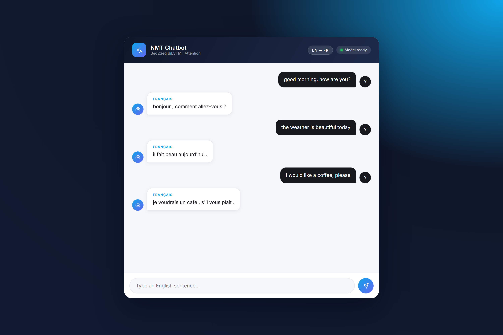

<div align="center">

# Neural Machine Translation Chatbot

**English → French translation in a chat interface, powered by a Seq2Seq BiLSTM with Attention built from scratch in PyTorch.**

<br>


<br>



</div>

---

## Overview

A complete neural machine translation project — the model architecture, training, serving, and interface are all built here, not imported from a translation API:

- **The model** — a bidirectional LSTM encoder, Bahdanau-style attention, and an LSTM decoder, implemented from scratch in PyTorch ([`backend/app/model.py`](backend/app/model.py)) and trained in the [included notebook](Neural_Machine_Translation.ipynb)
- **The API** — FastAPI service with typed request/response models, a `/health` readiness probe, and graceful degradation (503 with a clear message when the checkpoint isn't present)
- **The interface** — a chat UI with typing indicators, animated responses, a live model-status badge, and Enter-to-send, served by the same FastAPI process

---

## How It Works

```
"good morning, how are you?"
        │
spaCy tokenization → vocabulary encoding (<sos> … <eos>)
        │
BiLSTM encoder (2 layers, bidirectional, 512 hidden)
        │
Attention over every encoder state at each decoding step
        │
LSTM decoder generates French tokens until <eos>
        │
"bonjour , comment allez-vous ?"
```

The decoder is greedy (argmax per step, capped at `MAX_LEN`). Beam search is on the roadmap.

---

## Getting Started

**Prerequisites:** Python 3.10 – 3.12.

```bash
git clone https://github.com/Muhammadwaqas1234/Neural-Machine-Translation-Chatbot.git
cd Neural-Machine-Translation-Chatbot/backend

python -m venv venv
venv\Scripts\activate            # Windows  (source venv/bin/activate on macOS/Linux)
pip install -r requirements.txt
python -m spacy download en_core_web_sm

uvicorn app.main:app --reload
```

Open **http://127.0.0.1:8000** — the chat UI and the API are served by the same process. Interactive API docs at `/docs`.

### Model checkpoint

The trained weights (`nmt_seq2seq_attention.pth`, ~100MB+) are **not committed** to the repository. Train the model with [`Neural_Machine_Translation.ipynb`](Neural_Machine_Translation.ipynb) and save the checkpoint to `backend/app/nmt_seq2seq_attention.pth` (or point `MODEL_PATH` elsewhere). Until then the API stays up and reports the missing model cleanly — the UI badge shows "Model not loaded" and `/translate` returns a structured 503.

---

## API

| Method | Endpoint | Description |
| :--- | :--- | :--- |
| `POST` | `/translate` | `{ "text": "..." }` → `{ "translation": "...", "source_lang": "en", "target_lang": "fr" }` |
| `GET` | `/health` | Model readiness probe |
| `GET` | `/` | Chat interface |

---

## Project Structure

```
├── Neural_Machine_Translation.ipynb   # Training notebook (data prep → training → export)
├── backend/
│   ├── requirements.txt
│   └── app/
│       ├── main.py          # FastAPI app — API + serves the frontend
│       ├── model.py         # Encoder, Attention, Decoder, Seq2Seq (PyTorch)
│       ├── inference.py     # Lazy checkpoint loading + greedy decoding
│       └── vocab.py         # spaCy tokenization + vocabulary encoding
├── frontend/
│   ├── index.html           # Chat interface
│   ├── style.css
│   └── script.js
└── docs/demo.mp4            # Demo recording
```

---

## Roadmap

- Beam search decoding
- BLEU score evaluation endpoint
- Multi-language pairs
- Dockerfile + hosted checkpoint download

---

## Author

**Muhammad Waqas** — [github.com/Muhammadwaqas1234](https://github.com/Muhammadwaqas1234)

<div align="center">

<br>

*Built from scratch: architecture · training · serving · interface.*

</div>
